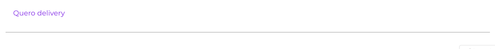
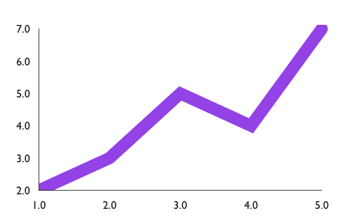

<h1 align="center">
  
</h1>


<p align="center">
   <h2 align="center">
    Quero Components Web
    </h2>
</p>

<p align="center">
  Biblioteca de components web do Quero Delivery
</p>

<p align="center">
 

  <a aria-label="Last Commit" href="https://github.com/querodelivery/quero-components-web/commits/master">
    
  
  </a>
</p>
<p align="center">
  <a target="_blank" href="https://www.typescriptlang.org">
    
  </a>
  <a target="_blank" href="https://reactjs.org/">
    
  </a>
  <a target="_blank" href="https://storybook.js.org/docs/react/get-started/introduction">
    
  </a>
</p>

## 💜 O que é?
 A Quero Components Web é uma biblioteca de componentes reutilizáveis, auxiliando o usuário na construção de interfaces de forma mais rápida e produtiva.
 <br> </br>

## 👨‍💻 Como instalar?

```bash
# Utilizando npm
npm install @quero-delivery/quero-components-web

# Utilizando yarn
yarn add @quero-delivery/quero-components-web
```


## 🏃 Como usar?

```tsx
import { InputLine } from "@quero-delivery/quero-components-web";
import "@quero-delivery/quero-components-web/dist/index.css";

export function HomeFourcopy() {
  return (
    <InputLine
      label="Quero delivery"
      onChange={() => {}}
    />
  )
}
```


## 📊 Como usar gráficos?

Os gráficos são utilizados a partir da biblioteca [Victory](https://formidable.com/open-source/victory/docs)

- Instalação

```bash
# Utilizando npm
npm install victory

# Utilizando yarn
yarn add victory
```
<b>Exemplo de uso

```tsx
<VictoryChart>
  <VictoryLine
    groupComponent={<VictoryClipContainer clipPadding={{ top: 5, right: 10 }}/>}
    style={{ data: { stroke: "#9b4dee", strokeWidth: 15, strokeLinecap: "round" } }}
    data={sampleData}
  />
</VictoryChart>
```


## 📚 Quais bibliotecas são usadas?
- [React Hook Form](https://reactdatepicker.com/)
- [Semantic UI React](https://react.semantic-ui.com")
- [React Datepicker](https://reactdatepicker.com/)


## 🎨 Quais cores foram utilizadas no padrão da biblioteca?

```css
brand: #9b4dee;
brandPink: #e0457b;
brandYellow: #f7ea48;
brandDark: #6700a2;
brandLight: #d8b8f9;
```


> Confira a documentação da biblioteca para mais detalhes de uso [Documentação victory](https://formidable.com/open-source/victory/docs).


## 📝 Documentação

Para verificar a documentação click [aqui](https://querodelivery.github.io/quero-components-web/)

- Verificar em desenvolvimento
```bash
npm run start ou yarn start
```

```bash
cd example
npm run storybook ou yarn storybook

## A documentação será aberta na porta:6006 - acesse http://localhost:6006
```

## 🤝  Como contribuir para o projeto?

- Entre em nosso repositorio no [GitHub](https://github.com/QueroDelivery/quero-components-web); 
- Faça um **fork** do projeto;
- Salve as alterações e crie uma mensagem de commit contando o que você fez.
- Envie as suas alterações.
- Realize um pull request para que seja analisado.

> Caso tenha alguma dúvida confira este [guia de como contribuir no GitHub](https://github.com/firstcontributions/first-contributions).

